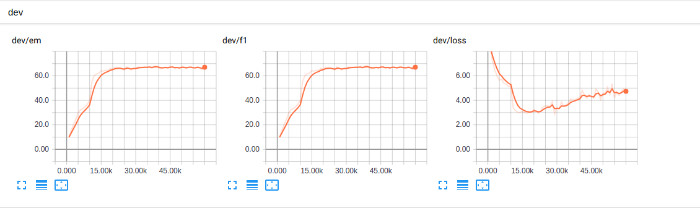
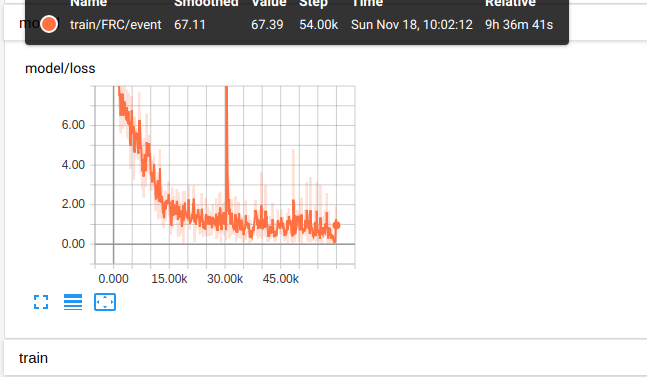

# QAnet Chinese Reading Comprehension

demo 畫面 <https://github.com/sinlin0908/QAmodel_Demo>

- [QAnet Chinese Reading Comprehension](#qanet-chinese-reading-comprehension)
  - [Reference](#reference)
  - [Environment](#environment)
  - [Requirement](#requirement)
  - [Data Set](#data-set)
  - [Modify](#modify)
      - [prepro file](#prepro-file)
      - [embedding dat set](#embedding-dat-set)
      - [Config](#config)
  - [Usage](#usage)
  - [Performance](#performance)
  - [Tensorbord](#tensorbord)
  - [Comparison Chart](#comparison-chart)

## Reference

- [QAnet by google](https://arxiv.org/abs/1804.09541)
- [QAnet Code by NLP_learn](https://github.com/NLPLearn/QANet)
- [Data Set by Delta](https://github.com/DRCSolutionService/DRCD)
- [Embedding data set by Chinese-Word-Vectors](https://github.com/Embedding/Chinese-Word-Vectors)

## Environment

- OS: Ubuntu 18.04 LTS
- GPU: GTX 1080Ti 11G
- CPU: i7-4770
- RAM: 16G

## Requirement

- Python 3.6
- NumPy
- tqdm
- Tensorflow>=1.5
- Jieba
- opencc
- bottle

## Data Set

- train set : 26936 questions
- dev set : 3524 questions
- test 3493 : questions

## Modify

#### prepro file

- word token: use `jieba.cut(context,cut_all=False)`
- `_getword()` delete `word.lower(), word.capitalize(), word.upper()`

#### embedding dat set

- use 1292607 words 300d embedding data set
- use 14082 characters 300d character embedding data set

#### Config

- word size: 1292607
- hidden size: 128
- num_head: 8
- batch size: 12
- char_emb_size : 300d
- pretrain_char -> True

## Usage

```bash
python config.py --mode prepro
```

train

```bash
python config.py --mode train
```

test

```bash
python config.py --mode test
```

demo:

```bash
python config.py --mode demo
```

## Performance

- F1: score 70.0496230556
- EM: 70.0257658173
- cost: 6 hours
- use GPU memory : 9.4G

## Tensorbord

```bash
tensorboard --logdir=./
```




## Comparison Chart

| number | hidden size | attention head | epoch  | data size | word embedding size | F1  | EM  |
| ------ | ----------- | -------------- | ------ | --------- | ------------------- | --- | --- |
| 1      | 96          | 1              | 60000  | 15320     | 636086              | 51  | 51  |
| 2      | 96          | 1              | 60000  | 26936     | 636086              | 63  | 63  |
| 3      | 128         | 8              | 60000  | 26936     | 1292607             | 70  | 70  |
| 4      | 128         | 8              | 150000 | 26936     | 1292607             | 69  | 69  |

notice: character embedding has a little effect
